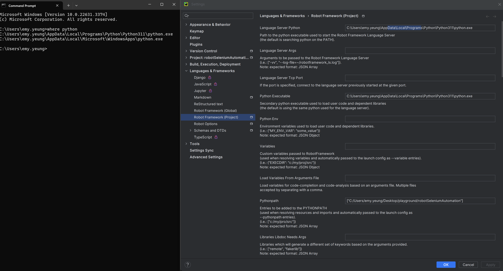

# ROBOT SELENIUM AUTOMATION
## Setup Robot Selenium Framework
### Uninstall old version: https://stackoverflow.com/questions/72005302/completely-uninstall-python-3-on-mac 
https://stackoverflow.com/questions/64362772/switching-python-version-installed-by-homebrew 
### Install python3: https://robotframework.org/robotframework/latest/RobotFrameworkUserGuide.html#python-installation 
### Download Python: https://www.python.org/downloads/ 
### Check version: python3 —version
### Install pip: https://stackoverflow.com/questions/17271319/how-do-i-install-pip-on-macos-or-os-x 
curl https://bootstrap.pypa.io/get-pip.py | python
sudo easy_install pip

### https://formulae.brew.sh/formula/pypy 
brew update && brew upgrade 
brew install python3
brew install pypy
Check python: pip3

brew unlink python@3.9
brew link --force python@3.9

Install pypy: https://formulae.brew.sh/formula/pypy or  https://www.pypy.org/download.html 
Run the the following commands to install Robot and Selenium Framework
python3 -m pip install --upgrade pip
pip3 install --upgrade robotframework
pip3 install robotframework-lsp
pip3 install --upgrade robotframework-databaselibrary
pip3 install --upgrade robotframework-pdf2textlibrary
pip3 install --upgrade robotframework-requests
pip3 install --upgrade robotframework-seleniumlibrary
pip3 install --upgrade robotframework-browser
pip3 install --upgrade pyodbc
rfbrowser init
pip3 list

Check:  robot --version
check python path on macOS: which python3 or where python 3
Add python3 path to pycharm settings -> Languages & Frameworks > Robot Framework: fill path in language server python and python executable, and language server args: ["-vv", "--log-file=~/robotframework_ls.log"] 
Install plugins:
    Intellibot #patched
    robot framework language server

### Download browserdriver
    chrome driver: https://chromedriver.chromium.org/downloads 

### check python path

## Setup allure report
    1. npm install -g allure-commandline --save-dev
    2.  pip install allure-robotframework 
    3. Execute test: robot --listener allure_robotframework testCases/sortingToolsTestCases/sortingToolsTestSuite.robot
    4. opent allure report: allure serve output/allure  
